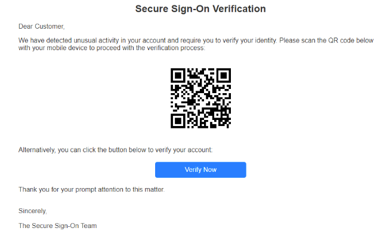
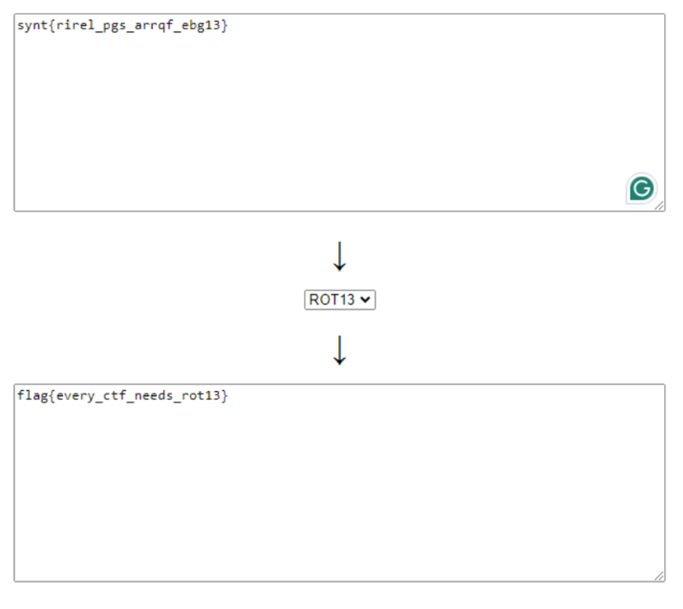

# Cybersecurity Writeups

## Overview

This repository contains my solutions for various cybersecurity challenges, including defensive and offensive security tasks. The challenges involve vulnerability identification, decoding encrypted data, Suricata analysis, and phishing simulations. The solutions are broken into two sections: Defensive Security and Offensive Security. 

---

## Table of Contents

1. [Defensive Security Writeups](#defensive-security-writeups)
   - [Problem 1: Secure Your Perimeter](#problem-1-Secure-your-Perimeter)
   - [Problem 2: Investigate a Suspicious Email](#problem-2-qr-code-decryption)
   - [Suricata Analysis](#suricata-analysis)
2. [Offensive Security Writeups](#offensive-security-writeups)
   - [Problem 1: Find your Targets](#information-gathering)
   - [Problem 2: Build a Credential Harvester](#website-phishing-simulation)
   - [Problem 3: Squishy MFA - XOR Encryption with Base](#xor-encryption-with-base64)

---

## Defensive Security Writeups

### Problem 1: Secure your Perimeter 

In this challenge, I was provided with a network diagram and a JSON file containing security vulnerabilities detected through Centauros. 
```
{
                        "vulnerability_name": "Google Chrome < 125.0.6422.112 Vulnerability",
                        "synopsis": "A web browser installed on the remote Windows host is affected by a vulnerability.",
                        "description": "The version of Google Chrome installed on the remote Windows host is prior to 125.0.6422.112.",
                        "solution": "Upgrade to Google Chrome version 125.0.6422.112 or later.",
                        "cve": "CVE-2024-5274",
                        "severity_name": "Critical"
                    },
                    {
{
                        "vulnerability_name": "Microsoft Edge (Chromium) < 126.0.2592.56 Multiple Vulnerabilities",
                        "synopsis": "The remote host has an web browser installed that is affected by multiple vulnerabilities.",
                        "description": "The version of Microsoft Edge installed on the remote Windows host is prior to 126.0.2592.56. It is, therefore, affected by multiple vulnerabilities.",
                        "solution": "Upgrade to Microsoft Edge version 126.0.2592.56 or later.",
                        "cve": "CVE-2024-5830",
                        "severity_name": "Critical"
                    },

   {
                        "vulnerability_name": "Windows 10 Version 21H2 Security Update",
                        "synopsis": "The remote Windows host is affected by multiple vulnerabilities.",
                        "description": "The remote Windows host is missing security update 5039211. It is, therefore, affected by multiple vulnerabilities.",
                        "solution": "Apply Security Update 5039211.",
                        "cve": "CVE-2024-29994",
                        "severity_name": "Critical"
                    },
                    {
  {
                        "vulnerability_name": "Python Unsupported Version Detection",
                        "synopsis": "The remote host contains one or more unsupported versions of Python.",
                        "description": "The remote host contains one or more unsupported versions of Python.",
                        "solution": "Upgrade to a version of Python that is currently supported.",
                        "cve": "CVE-2021-87459",
                        "severity_name": "Critical"
                    },
                    {
   {
                        "vulnerability_name": "Google Chrome < 125.0.6422.112 Vulnerability",
                        "synopsis": "A web browser installed on the remote Windows host is affected by a vulnerability.",
                        "description": "The version of Google Chrome installed on the remote Windows host is prior to 125.0.6422.112.",
                        "solution": "Upgrade to Google Chrome version 125.0.6422.112 or later.",
                        "cve": "CVE-2024-5274",
                        "severity_name": "Critical"
                    },
                    {


```
Steps:
1. Analyzed the network diagram to identify the hosts within the environment.
2. Cross-referenced each host with the detected vulnerabilities from Centauros.
3. Prioritized my assessment based on severity levels provided in the JSON file.


The five critical vulnerabilities I focused on are:

- **Google Chrome < 125.0.6422.112 Vulnerability**
- **Microsoft Edge (Chromium) < 126.0.2592.56 Multiple Vulnerabilities**
- **Windows 10 Version 21H2 Security Update**
- **Python Unsupported Version Detection**

```
{
                        "vulnerability_name": "Windows 10 Version 21H2 Security Update",
                        "synopsis": "The remote Windows host is affected by multiple vulnerabilities.",
                        "description": "The remote Windows host is missing security update 5039211. It is, therefore, affected by multiple vulnerabilities.",
                        "solution": "Apply Security Update 5039211.",
                        "cve": "CVE-2024-29994",
                        "severity_name": "Critical"
                    },
                    {

```

After analyzing each of the vulnerabilities, I chose **Windows 10 Version 21H2 Security Update (CVE-2024-29994)** as the most critical, given  the scope of its potential OS-level impact.

### Problem 2: Investigate a Suspicious Email 



In this challenge, I scanned a QR code and received the output `Synt{rirel_pgs_arrqf_ebg13}`. Right away, I realized I had overlooked something obvious—the format was supposed to be flag{...}, but instead, I got synt{...}. That had to mean it was encoded in some cipher. Time to figure out which one. It clearly wasn’t Base64 or SHA-256, so those were off the table. The word “synt” stood out, and I started noticing a pattern—letters seemed to be mapped, like f → s, y → l, a → n, and g → t. That suggested some kind of substitution cipher, and the key appeared to be "flag".I briefly considered Vigenère, but the presence of numbers made that unlikely. So, it had to be a straightforward substitution cipher. 

So yeah, I tossed that flag into a cipher program and let it do the heavy lifting for me. My educated guess paid off, and I ended up with a (kinda) legible message. First, I got "Ever", then "Seem", followed by "rch 13"—and that’s when it clicked. I know a cipher decryptor called ROT13. And guess what? It’s a substitution cipher. That's how I got the flag!



### Suricata Analysis

**IOC Detection**  

I reviewed the Suricata documentation for the `alert` function and noticed it was missing the necessary content for detection. After adding `content: "wood-chewers.trees"`, the alert triggered, successfully identifying the indicator of compromise (IOC) and revealing the flag.

I analyzed Suricata logs to detect malicious activity:
I went through the Suricata logs and tracked the source IP addresses. There were 8 distinct IP addresses all pointing to the same destination IP, so that meant 8 compromised users. The answer was 8.
It turns out that the destination IP was using the POST function, which is typically a sign that user credentials were being sent to a source( in this case, likely an attacker). That made it pretty clear why there were multiple compromised users.

So essentially this is a summary of my observations.
1. **Identified compromised users** by tracking the source IP addresses.
2. **Multiple POST requests** pointed to the same destination IP, indicating credential exfiltration.

---

## Offensive Security Writeups

### Problem 1: Find your Targets

In this Open Source Intelligence (OSINT) task, I was asked to gather information about a potential target employee, Alex Lee, who had no publicly available information. Through social media connections and researching friends of Alex, I discovered a GitHub link that led me to the flag.

**Steps**:
1. Searched for friends of Alex Lee (Olivia Stone, Maxwell, Camilla Grey).
2. Found a reply to Camilla's post from Alex Lee with a link to their GitHub.
3. Accessed the GitHub to retrieve the flag.

### Problem 2: Investigate a Suspicious Email

For the phishing simulation, I cloned a website and used a local server to host it. I set default credentials (username: username, password: password), which allowed me to retrieve the flag.

**Steps**:
1. Installed a website cloning tool (Cyotek WebCopy).
2. Hosted the cloned website locally using Microsoft's `HTTP Server - Host static webpages`.
3. Used default credentials to access the site and retrieve the flag.

The flag was: `h4rv3ster_h3r0`.

### Problem 3: Squishy MFA- XOR Encryption with Base64

In this challenge, the flag was encoded using Base64 and XOR encryption. The key for XOR decryption was hidden in the date of a company email. 

**Steps**:
1. Decrypted the Base64 encoded message using XOR with the company's email date.
2. Reversed the XOR encryption to retrieve the correct flag.

Finally, I submitted the QR code after encoding it back into Base64 to obtain the correct flag.

---

## Conclusion

This repository showcases my approach to solving different cybersecurity challenges. Each task required critical thinking, an understanding of various tools, and the ability to apply theory to real-world scenarios. I look forward to expanding my knowledge and continuing to tackle more challenges in the future.

---

### License

This repository is licensed under the MIT License - see the [LICENSE](LICENSE) file for details.

---
